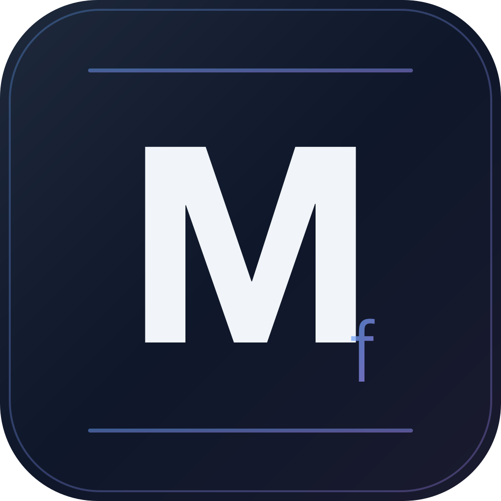

#  BluSlate

Cross-platform tool to rename TV show files using [TMDb](https://www.themoviedb.org/) and [DVDCompare.net](https://www.dvdcompare.net/) metadata.

Available as a desktop app, CLI, self-hosted web app, or Docker container.

> [!IMPORTANT]
> 🤖 This application made heavy use of Claude Code to develop it, and is likely to contain errors. Please report [issues](https://github.com/JohnPostlethwait/BluSlate/issues) if you find them. 🤖


## Why BluSlate?

Most media scrapers rely on files already being named correctly — they fail completely on raw DVD/Blu-ray rips with generic filenames like `title_t00.mkv`.

BluSlate solves this by matching files against TMDb episode runtimes instead of filenames, so you can get your rips correctly named before running any other tool.

## Features

- **Runtime-based batch matching** — Matches MakeMKV disc rips by episode runtime, not filename
- **TMDb integration** — Accurate episode metadata from The Movie Database
- **[DVDCompare.net](https://www.dvdcompare.net/) integration** — Sub-second disc runtime data for better matching
- **ffprobe runtime detection** — Probes file durations for matching (gracefully degrades if unavailable)
- **Confidence scoring** — Each match scored 0–100 based on title similarity, runtime, and position
- **Custom naming templates** — Configurable output format with placeholders
- **Dry-run mode** — Preview all renames before committing
- **Undo support** — Reverse renames using a saved manifest
- **Specials detection** — Unmatched files matched against TMDb Season 0 (Specials)
- **Cross-platform** — macOS, Windows, Linux, Docker

## Download

Pre-built installers are available on the [Releases page](https://github.com/JohnPostlethwait/BluSlate/releases):

| Platform | File |
|----------|------|
| macOS (Apple Silicon) | `BluSlate-x.x.x-arm64.dmg` |
| macOS (Intel) | `BluSlate-x.x.x-x64.dmg` |
| Windows | `BluSlate-x.x.x-setup.exe` |
| Linux (AppImage) | `BluSlate-x.x.x-x86_64.AppImage` |
| Linux (Debian/Ubuntu) | `BluSlate-x.x.x-amd64.deb` |

Download the installer for your platform and open it. On macOS, drag BluSlate to your Applications folder. No build step required.

## Prerequisites

- **TMDb API key** — Free. Get a Read Access Token at [themoviedb.org/settings/api](https://www.themoviedb.org/settings/api)
- **ffprobe** (optional, strongly recommended) — Install via [ffmpeg](https://ffmpeg.org/download.html). Packaged GUI and CLI builds include ffprobe automatically.

## Usage

### Desktop App (GUI)

Launch BluSlate from your Applications folder (macOS) or Start Menu (Windows). The GUI walks you through selecting a directory, reviewing matches, and confirming renames.

### CLI

```bash
bluslate <directory> [options]
```

| Flag | Description | Default |
|------|-------------|---------|
| `-n, --dry-run` | Preview changes without renaming | `false` |
| `-k, --api-key <key>` | TMDb API Read Access Token | — |
| `--template <pattern>` | Custom naming template | — |
| `-r, --recursive` | Scan subdirectories | `false` |
| `-y, --yes` | Skip review for matches above the confidence threshold | `false` |
| `--min-confidence <n>` | Minimum confidence threshold for matching (0–100) | `85` |
| `--lang <code>` | TMDb language code | `en-US` |

**Examples:**

```bash
# Rename TV episodes in a directory
bluslate /path/to/tv/shows

# Dry-run with recursive scan
bluslate -r -n /media/tv/show

# Provide API key inline
TMDB_API_KEY=your_token bluslate /media/tv

# Custom naming template
bluslate --template '{show_name} {season}x{episode}' /media/tv
```

**API key resolution order:** `--api-key` flag → `TMDB_API_KEY` env var → config file (`bluslate config`)

### Docker (self-hosted web app)

Pre-built images are published to [GitHub Container Registry](https://ghcr.io/johnpostlethwait/bluslate) on every release.

```bash
docker run -d \
  -p 3000:3000 \
  -v /path/to/media:/media \
  -v bluslate-data:/data \
  -e TMDB_API_KEY=your-key-here \
  ghcr.io/johnpostlethwait/bluslate:latest
```

Then open [http://localhost:3000](http://localhost:3000) in your browser.

#### Docker Compose

Create a `docker-compose.yml`:

```yaml
services:
  bluslate:
    image: ghcr.io/johnpostlethwait/bluslate:latest
    ports:
      - "3000:3000"
    volumes:
      - /path/to/media:/media       # Mount your media directory here (required)
      - bluslate-data:/data         # Persistent config and undo history
    environment:
      - TMDB_API_KEY=your-key-here  # Required
      # - BLUSLATE_LANGUAGE=en-US
      # - BLUSLATE_TEMPLATE={show_name} - S{season}E{episode} - {episode_title}
      # - BLUSLATE_MIN_CONFIDENCE=85
    restart: unless-stopped

volumes:
  bluslate-data:
```

```bash
docker compose up -d
```

> [!TIP]
> See [`docker-compose.example.yml`](docker-compose.example.yml) for a fully commented configuration template. To pin to a specific version, replace `latest` with a version tag (e.g., `ghcr.io/johnpostlethwait/bluslate:0.2.2`). To build from source instead, replace `image:` with `build: .` and clone the repo.

| Variable | Required | Default | Description |
|----------|----------|---------|-------------|
| `TMDB_API_KEY` | Yes | — | TMDb Read Access Token |
| `BLUSLATE_LANGUAGE` | No | `en-US` | BCP 47 language code for TMDb metadata |
| `BLUSLATE_TEMPLATE` | No | `{show_name} - S{season}E{episode} - {episode_title}` | Default naming template |
| `BLUSLATE_MIN_CONFIDENCE` | No | `85` | Minimum confidence threshold (0–100) — matches at or above are pre-approved for review |
| `BLUSLATE_PASSWORD` | No | — | Enable password auth (see security note below) |
| `PORT` | No | `3000` | Port the server listens on inside the container |

> [!WARNING]
> **The web server has no authentication by default.** Anyone who can reach port 3000 can rename your media files and read your TMDb API key. Never expose BluSlate directly to the internet without protection.
>
> **Option 1 — Password auth (built-in):** Set `BLUSLATE_PASSWORD` in your environment. The browser will prompt for the password on first visit and store it for the session.
> ```yaml
> environment:
>   - BLUSLATE_PASSWORD=a-strong-random-password
> ```
>
> **Option 2 — Reverse proxy:** Run BluSlate behind Nginx, Caddy, or Traefik with authentication and TLS. This is recommended for internet-facing deployments.
>
> **Option 3 — Keep it local:** Run BluSlate only on your home network and do not forward port 3000 through your router.

## Naming Templates

| Placeholder | Description |
|-------------|-------------|
| `{show_name}` | Show title |
| `{year}` | Release year |
| `{season}` | Season number (zero-padded) |
| `{episode}` | Episode number or range (e.g., `01` or `01-02`) |
| `{episode_title}` | Episode name |
| `{ext}` | Original file extension |

**Default:** `{show_name} - S{season}E{episode} - {episode_title}`

## Contributing

See [CONTRIBUTING.md](CONTRIBUTING.md) for development setup, build commands, architecture, and testing.

## License

[ISC](https://opensource.org/licenses/ISC)
